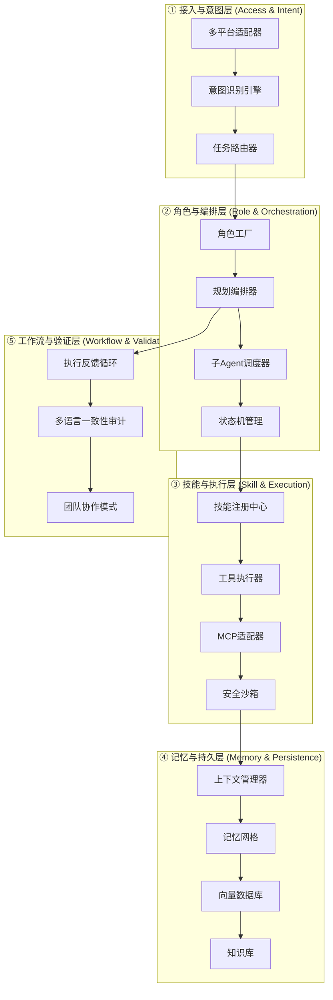

# 超级AI团队最佳实践PRD

> 基于24个开源AI项目的结构模块深度分析与重组
> 版本: 2.0.0 | 日期: 2026-04-01

---

## 一、PRD概述

### 1.1 项目背景

通过对24个顶级AI项目（包括OpenClaw、MetaGPT、DeerFlow、OpenManus、GStack、claw-code等）的深度分析，提取出可复用的核心结构模块，重新组合成一套**超级AI团队最佳实践架构**。特别整合了claw-code项目的智能体装配（Agent Harness）机制，实现LLM与本地工具、文件系统和执行反馈循环的高效连接。

### 1.2 设计目标

- **模块化**: 每个组件可独立迁移、替换、升级
- **可扩展**: 支持从单Agent到多Agent协作的平滑扩展
- **生产级**: 包含完整的安全、监控、容错机制
- **成本优化**: 智能模型路由，降低60%+ API成本
- **执行闭环**: 实现"运行测试 -> 捕获错误 -> 反馈给AI -> 修改"的自动化循环

### 1.3 核心设计理念

```
┌─────────────────────────────────────────────────────────────┐
│                    超级AI团队架构核心                         │
├─────────────────────────────────────────────────────────────┤
│  意图驱动 (Intent-Driven)  +  协议优先 (Protocol-First)       │
│  角色分离 (Role-Separation)  +  记忆融合 (Memory-Fusion)      │
│  工具原子化 (Atomic-Tools)  +  安全沙箱 (Secure-Sandbox)      │
│  执行闭环 (Execution-Loop)  +  多语言一致性 (Parity-Audit)     │
└─────────────────────────────────────────────────────────────┘
```

---

## 二、系统架构总览

### 2.1 四层架构模型



---

## 三、模块开发路径与填充方案

### 3.1 模块清单与优先级

| 层级             | 模块名称       | 优先级    | 复杂度    | 预估工期   |
| -------------- | ---------- | ------ | ------ | ------ |
| **L1-接入与意图层**  | <br />     | <br /> | <br /> | <br /> |
| <br />         | 多平台适配器     | P0     | 中      | 3天     |
| <br />         | 意图识别引擎     | P0     | 高      | 5天     |
| <br />         | 任务路由器      | P0     | 中      | 2天     |
| **L2-角色与编排层**  | <br />     | <br /> | <br /> | <br /> |
| <br />         | 角色工厂       | P0     | 高      | 5天     |
| <br />         | 规划编排器      | P1     | 高      | 7天     |
| <br />         | 子Agent调度器  | P1     | 中      | 4天     |
| <br />         | 状态机管理      | P1     | 中      | 3天     |
| **L3-技能与执行层**  | <br />     | <br /> | <br /> | <br /> |
| <br />         | 技能注册中心     | P0     | 中      | 4天     |
| <br />         | 工具执行器      | P0     | 高      | 5天     |
| <br />         | 工具描述与装配协议  | P0     | 中      | 3天     |
| <br />         | MCP适配器     | P1     | 高      | 5天     |
| <br />         | 安全沙箱       | P1     | 高      | 6天     |
| **L4-记忆与持久层**  | <br />     | <br /> | <br /> | <br /> |
| <br />         | 上下文管理器     | P0     | 中      | 3天     |
| <br />         | 环境感知的上下文提取 | P1     | 高      | 6天     |
| <br />         | 记忆网格       | P0     | 高      | 7天     |
| <br />         | 向量数据库      | P1     | 中      | 4天     |
| **L5-工作流与验证层** | <br />     | <br /> | <br /> | <br /> |
| <br />         | 执行反馈循环     | P1     | 高      | 7天     |
| <br />         | 多语言一致性审计   | P2     | 极高     | 10天    |
| <br />         | 团队协作模式     | P2     | 高      | 6天     |
| **基础设施层**      | <br />     | <br /> | <br /> | <br /> |
| <br />         | 配置管理       | P0     | 低      | 2天     |
| <br />         | 监控系统       | P1     | 中      | 4天     |
| <br />         | 消息队列       | P1     | 低      | 2天     |
| <br />         | 存储系统       | P0     | 中      | 3天     |

### 3.2 开发实施建议

```
Phase 1 (Week 1-2): 基础设施 + L1层
├── 配置管理
├── 存储系统
├── 消息队列
├── 多平台适配器
├── 意图识别引擎 (基础版)
└── 任务路由器

Phase 2 (Week 3-4): L2层 + L3层核心
├── 角色工厂
├── 技能注册中心
├── 工具执行器
├── 工具描述与装配协议
├── 上下文管理器
└── 记忆网格 (基础版)

Phase 3 (Week 5-6): L3层增强 + L4层
├── MCP适配器
├── 安全沙箱
├── 规划编排器
├── 子Agent调度器
├── 状态机管理
├── 环境感知上下文提取
└── 向量数据库

Phase 4 (Week 7-8): L5层 + 完善
├── 执行反馈循环
├── 团队协作模式
├── 多语言一致性审计
├── 监控系统
└── 性能优化
```

---

## 四、参考项目索引

| 项目 | 核心贡献模块 | GitHub |
|------|-------------|--------|
| OpenClaw | MCP适配器、记忆网格 | github.com/openclaw |
| MetaGPT | 角色工厂、多Agent协作 | github.com/geekan/MetaGPT |
| DeerFlow | 规划编排器、Harness | github.com/bytedance/deer-flow |
| OpenManus | 工具执行器、Skill系统 | github.com/mannaandpoem/OpenManus |
| GStack | 角色定义规范、CLAUDE.md | YC内部项目 |
| OpenFang | 多平台适配器、安全层 | github.com/RightNow-AI/openfang |
| MiniMax Skills | 技能定义规范、跨平台迁移 | github.com/MiniMax-AI/skills |
| OPC-Skills | 意图识别、上下文管理 | Ace浏览器内部 |
| agency-agents-zh | 角色Prompt模板 | github.com/agency-agents-zh |
| claw-code | 智能体装配、执行循环、审计机制 | github.com/claw-code |

---

**文档版本**: 2.0.0  
**最后更新**: 2026-04-01  
**维护者**: AI架构团队